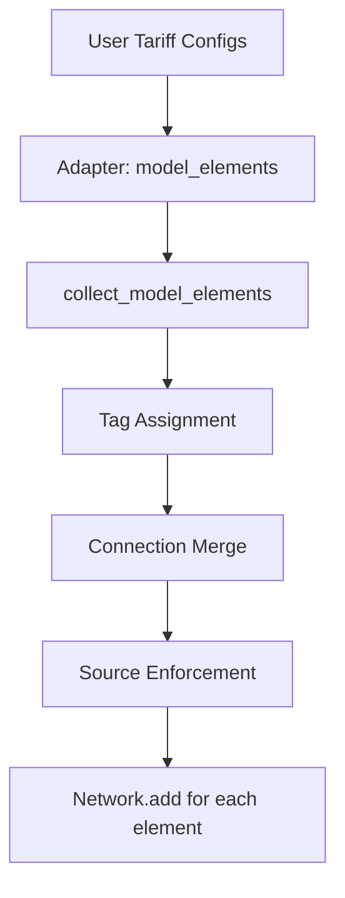

# Tariff Compilation

This guide explains how user-configured tariffs compile into tagged power flow constraints in the LP model.

## Overview

Tariffs are a device-layer concept.
Users configure source–destination pairs and prices.
The system compiles these into model-layer constructs: tag IDs on connections and scoped pricing segments.

The compilation happens in `collect_model_elements()` after all adapters have produced their model element configs and before the network is built.

## Compilation Pipeline



### Step 1: Tag Assignment

Each source device referenced by any tariff gets a unique integer tag ID.
Tag 0 is reserved for untagged/default power.

```python
# Pseudo-code
tag_counter = 1
for tariff in tariffs:
    for source in tariff.sources:
        if source not in tag_map:
            tag_map[source] = tag_counter
            tag_counter += 1
```

### Step 2: Connection Tagging

Every connection in the network receives the full set of active tag IDs.
This ensures tagged power can flow through any path.

When no tariffs exist, connections only have tag 0 — identical to the untagged model.

### Step 3: Segment Injection

For each tariff, a pricing segment scoped to the relevant tag is added to the destination connection.
The **discriminating point** is the connection adjacent to the destination node where all tagged flow must pass.

For "any → Load" tariffs, the pricing segment goes on the Load's connection.
For "Grid → any" tariffs, the pricing segment goes on the Grid's connection.
For "Grid → Load" tariffs, the system picks the destination side (Load's connection).

### Step 4: Source Enforcement

At each source device's connection, a tag-scoped power limit ensures only that source's tag can carry outbound power.
Other tags get `max_power = 0` in the source→target direction.

This prevents the optimizer from "laundering" power by putting Grid power on the Solar tag to avoid tariffs.

## Architecture

### Where Compilation Lives

The compilation step is a post-processing phase in `collect_model_elements()` (in `core/adapters/registry.py`).
It runs after all adapters have produced their model element configs, but before the configs are passed to `Network.add()`.

This placement:
- Keeps adapters simple — each produces its own configs independently
- Centralizes cross-element logic (tariff → connection interaction)
- Runs before network construction, so the Network sees fully resolved configs

### What Adapters Produce

The tariff adapter produces a connection config with:
- Tags: the tariff's assigned tag ID
- Segments: a pricing segment scoped to that tag

The merge step folds this into the existing connection between the same endpoints.

### Model Layer Awareness

The model layer (Segment, Connection, Network) is tag-aware but tariff-unaware.
It operates on integer tag IDs and scoped segments without knowing about tariff rules.
All tariff semantics are resolved at the adapter/compilation layer.

## Example

User configures:

```
Grid → Load: $0.05/kWh
Solar → Load: $0.02/kWh
```

Network topology:
```
Grid ←→ Switchboard ←→ Load
Solar → Switchboard
Battery ←→ Switchboard
```

Compilation produces:

| Step | Result |
|------|--------|
| Tag assignment | Grid=1, Solar=2, Battery=3 |
| Connection tagging | All connections get tags [0, 1, 2, 3] |
| Segment injection | Load's connection gets `pricing(tag=1, price=0.05)` and `pricing(tag=2, price=0.02)` |
| Source enforcement | Grid's connection: `power_limit(tag=0, max_st=0)`, `power_limit(tag=2, max_st=0)`, `power_limit(tag=3, max_st=0)` — only tag 1 (grid) can flow out |

The optimizer then:
- Routes Grid power on tag 1 through Switchboard to Load, paying $0.05/kWh
- Routes Solar power on tag 2 through Switchboard to Load, paying $0.02/kWh
- Prefers Solar (cheaper) when available
- Battery can charge from any tag, discharges on tag 3

## Testing

Test tariff compilation with unit tests that verify:

1. **Tag assignment**: Unique IDs per source, tag 0 always present
2. **Connection merge**: Tariff segments folded into existing connections
3. **Source enforcement**: Only source's own tag flows outbound
4. **End-to-end**: Network with tariffs optimizes to expected cost

Tests live in `core/adapters/elements/tests/test_tariff_merge.py`.

## Related

- [Tagged Power Flow](../modeling/tagged-power.md) — mathematical formulation
- [Tariff Element](../user-guide/elements/tariff.md) — user guide
- [Adapter Layer](adapter-layer.md) — adapter architecture
