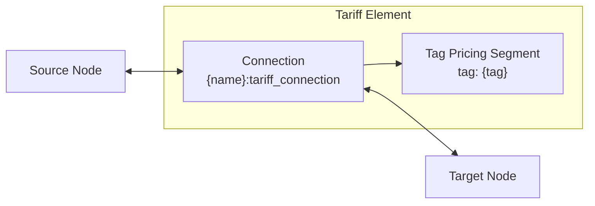

# Tariff

The Tariff device layer element models additional costs for specific categories of power flow between two nodes.

## Composition

A tariff element creates a single connection with a tag pricing segment:

## Model Elements

| Model Element | Type | Configuration |
|---------------|------|---------------|
| `{name}:tariff_connection` | Connection | Source, target, tag_pricing segment |

## Adapter Mapping

### Configuration → Model

The adapter creates a connection between the configured source and target nodes.
The connection contains a single `tag_pricing` segment configured with the tag name and directional pricing.

| Config Field | Model Parameter | Notes |
|-------------|-----------------|-------|
| `endpoints.source` | Connection source | Source node name |
| `endpoints.target` | Connection target | Target node name |
| `tag_pricing.tag` | Segment tag | Power flow category identifier |
| `tag_pricing.price_source_target` | Segment price_source_target | $/kWh, source→target |
| `tag_pricing.price_target_source` | Segment price_target_source | $/kWh, target→source |

### Model → Outputs

| Device Output | Model Source | Description |
|---------------|-------------|-------------|
| `tariff_power_source_target` | Connection power source→target | Tagged power flow s→t |
| `tariff_power_target_source` | Connection power target→source | Tagged power flow t→s |
