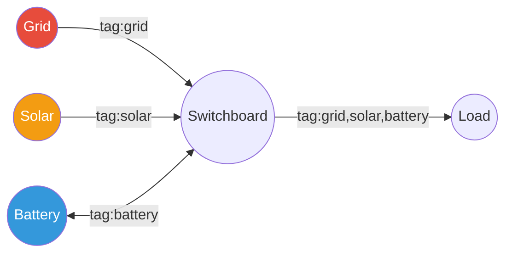

# Tagged Power Flow

Tagged power flow extends the connection model to track power provenance across the network.
Every kilowatt-hour carries a tag identifying where it originated, enabling tariff pricing based on source–destination pairs.

## Concept

In a standard HAEO network, power is fungible — a kilowatt flowing through a node could have come from any connected source.
Tagged power replaces this single-flow model with per-tag decomposition, analogous to VLANs in computer networking.

Each source device produces power on its own tag.
Tags propagate through every connection in the network.
At consumption points, tariff rules apply per-tag pricing — the cost depends on *where* the power came from.



## Networking Analogy

The system maps directly to networking concepts:

| Network Concept | HAEO Equivalent | Description |
|----------------|-----------------|-------------|
| VLAN | Power tag | Integer ID identifying power provenance |
| Switch port | Connection | Carries one or more tagged power flows |
| Router | Node | Forwards power across tags without restriction |
| Access port | Source connection | Power enters the network on one specific tag |
| Trunk port | Interior connection | Carries multiple tags between nodes |
| ACL | Tariff rule | Prices or filters specific tag flows |

### Tag Assignment

Tags are **integer IDs** assigned automatically as an implementation detail.
Users configure tariffs using device names; the system assigns tag IDs during network compilation.

- **Tag 0**: Default/untagged power — always present on every connection.
- **Tag N**: Power originating from a specific source device, auto-assigned.

When no tariffs are configured, every connection has only tag 0 and the system behaves identically to the untagged model.

## Mathematical Formulation

### Per-Tag Power Variables

Each segment in a connection creates LP variables per tag per direction:

$$
P^{st}_{tag,t} \geq 0 \quad \forall \text{tag} \in \text{Tags}, \; t \in \{0, \ldots, T-1\}
$$

$$
P^{ts}_{tag,t} \geq 0 \quad \forall \text{tag} \in \text{Tags}, \; t \in \{0, \ldots, T-1\}
$$

The total power flow is the sum across all tags:

$$
P^{st}_t = \sum_{\text{tag}} P^{st}_{tag,t}
$$

### Segment Constraints on Totals

Existing segment constraints (power limits, efficiency, time-slice) operate on the **total** power — the sum across all tags.
This preserves backward compatibility and ensures physical constraints always apply.

$$
P^{st}_t \leq P^{st}_{max,t} \quad \text{(total power limit, all tags)}
$$

### Tag-Scoped Constraints

Segments can optionally **scope** to a specific tag.
A scoped segment's constraints and costs apply only to that tag's variables:

$$
P^{st}_{tag_k,t} \leq P^{st}_{tag_k,max,t} \quad \text{(tag-specific limit)}
$$

$$
C_{tag_k} = \sum_t P^{st}_{tag_k,t} \cdot \pi_{tag_k,t} \cdot \Delta t_t \quad \text{(tag-specific pricing)}
$$

Both types of constraint coexist — tag-scoped constraints are **additive** to the total constraints.

### Per-Tag Segment Linking

Adjacent segments in a connection chain are linked per-tag:

$$
P^{out,st}_{tag,i}(t) = P^{in,st}_{tag,i+1}(t) \quad \forall \text{tag}, \; \forall i \in \text{segments}
$$

This ensures tagged power flows maintain provenance as they pass through efficiency, pricing, and power limit segments.

### Efficiency on Tagged Flows

Efficiency segments apply losses per-tag:

$$
P^{out,st}_{tag}(t) = P^{in,st}_{tag}(t) \cdot \eta_{st}(t)
$$

Each tag's power is reduced by the same efficiency factor, maintaining consistent loss modeling.

## Tariff Rules

A tariff is a user-configured rule with:

| Field | Type | Description |
|-------|------|-------------|
| Sources | Multi-select nodes or "any" | Where the power originates |
| Destinations | Multi-select nodes or "any" | Where the power is consumed |
| Price source→target | $/kWh | Cost for power flowing in this direction |
| Price target→source | $/kWh | Cost for power flowing in reverse |

### Compilation

The tariff compilation step converts user-facing tariff rules into tag assignments and scoped segments:

1. **Tag assignment**: Each source device that participates in any tariff gets a unique tag ID.
   Sources not referenced by any tariff remain on tag 0 only.

2. **Connection tagging**: Every connection in the network receives all active tag IDs.
   All connections act as trunk ports, carrying all tags.

3. **Segment injection**: For each tariff rule, a tag-scoped pricing segment is added to the
   connection at the **discriminating point** — the connection closest to the destination where
   all tagged flow must pass through.

4. **Source enforcement**: At source device connections, only the source's own tag can carry
   outbound power. Other tags are filtered to zero in the source→target direction on that connection.

### Multi-Hop Paths

Tags propagate through intermediate nodes automatically.
Consider:

```
Grid ←→ Switchboard ←→ Load
```

A tariff "Grid → Load: $0.05/kWh" results in:
- Grid connection: power leaving Grid is tagged as `tag:grid`
- Switchboard node: routes `tag:grid` power through to Load
- Load connection: scoped pricing segment charges $0.05 on `tag:grid` flow

The pricing applies **once** at the destination, not per-hop.

### Battery and Laundering

Batteries get their own tag when discharging.
Power flowing Grid → Battery → Load pays tariffs at both hops:

1. Grid → Battery: charged as grid-tagged power
2. Battery → Load: discharged as battery-tagged power (separate tariff may apply)

If `grid → battery` costs $0.03 and `battery → load` costs $0.02, the total is $0.05.
If `grid → load` directly costs $0.06, the optimizer will prefer the battery route.
This is intentional — the tariff prices reflect the configured costs.

## Implementation Notes

### Variable Count

With $K$ tags and $T$ time periods, each segment creates $2 \cdot K \cdot T$ power variables
(instead of $2 \cdot T$ without tags).
When only tag 0 is active (no tariffs), the variable count is identical to the untagged model.

### Backward Compatibility

When no tariffs are configured:
- All connections have tags = [0]
- All segments have a single tag with one set of variables
- `power_in_st` returns tag 0's variable directly (no sum computation)
- The model is functionally identical to the pre-tag implementation

### Source

:material-github: [`core/model/elements/segments/segment.py`](https://github.com/hass-energy/haeo/blob/main/custom_components/haeo/core/model/elements/segments/segment.py)
:material-github: [`core/model/elements/connection.py`](https://github.com/hass-energy/haeo/blob/main/custom_components/haeo/core/model/elements/connection.py)

## Connection Outputs

Connections expose per-tag power decomposition via the `connection_tagged_power` output:

```python
{
    0: {"source_target": OutputData(...), "target_source": OutputData(...)},
    1: {"source_target": OutputData(...), "target_source": OutputData(...)},
    2: {"source_target": OutputData(...), "target_source": OutputData(...)},
}
```

Each tag maps to its directional power flow arrays.
The total power (`connection_power_source_target`) is the sum across all tags.
When only tag 0 exists (no policies), the tagged output is omitted.

## Future: Path-Based VLAN Optimization

The current implementation assigns one VLAN per source node and propagates all VLANs
across all connections. This is correct but creates more variables than necessary when
many nodes don't interact.

A future optimization could assign VLANs per source→destination path combination,
collapsing identically-treated flows into shared VLANs. This would minimize variables
to only the connections that actually carry each flow, with "mapping segments" to
translate between VLANs at routing points.

For typical home systems (<10 nodes), the current approach is adequate.
The optimization becomes important for larger or more complex networks.

## Next Steps

<div class="grid cards" markdown>

- :material-connection:{ .lg .middle } **Connection model**

    ---

    Segment-based connection formulation.

    [:material-arrow-right: Connection formulation](model-layer/connections/connection.md)

- :material-layers:{ .lg .middle } **Segments**

    ---

    Segment catalog and formulations.

    [:material-arrow-right: Segment index](model-layer/segments/index.md)

- :material-cash:{ .lg .middle } **Tariff element**

    ---

    User-facing tariff configuration.

    [:material-arrow-right: Tariff guide](../user-guide/elements/tariff.md)

</div>
