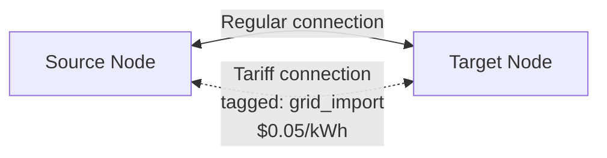

# Tariff

A **Tariff** element adds pricing to tagged power flows between two nodes in your energy network.
This enables modeling scenarios where power flowing from a specific source incurs additional costs—for example, charging a premium for grid-imported power that reaches a battery, or adding network usage fees.

## How It Works

A tariff creates a parallel connection between two nodes with a **tag pricing** segment.
When the optimizer routes power through this connection, it incurs the configured per-kWh costs.

The **tag** field identifies which category of power flow the tariff applies to. This allows multiple tariffs on the same node pair, each pricing a different type of power flow (e.g., "solar", "grid_import", "battery_discharge").

## Configuration

| Field | Description | Required |
|-------|-------------|----------|
| **Name** | Unique name for this tariff | Yes |
| **Source Node** | The node where tagged power originates | Yes |
| **Target Node** | The node where tagged power flows to | Yes |
| **Tag** | Name identifying the power flow category | Yes |
| **Price Source→Target** | Cost per kWh for power flowing source to target | No |
| **Price Target→Source** | Cost per kWh for power flowing target to source | No |

## Example: Grid Import Surcharge

To add a $0.05/kWh surcharge on power flowing from the grid to your switchboard:

- **Source**: Grid
- **Target**: Switchboard
- **Tag**: `grid_surcharge`
- **Price Source→Target**: 0.05 $/kWh

## Model Composition

A tariff element creates:

| Model Element | Type | Purpose |
|---------------|------|---------|
| `{name}:tariff_connection` | Connection | Parallel connection with tag pricing |

The connection contains a single `tag_pricing` segment that adds cost proportional to power flow.

## Sensors

| Sensor | Unit | Description |
|--------|------|-------------|
| `tariff_power_source_target` | kW | Power flowing source to target through the tariff |
| `tariff_power_target_source` | kW | Power flowing target to source through the tariff |

## Advanced Usage

Tariffs are an **advanced** element type. They work alongside existing connections and segments.
The optimizer considers the tariff cost when deciding how to route power, which can influence whether power takes a more expensive but necessary path or finds a cheaper alternative.

### Multiple Tariffs

You can configure multiple tariffs on the same node pair with different tags:

- `solar_fee`: Prices solar power flowing to grid at $0.02/kWh
- `grid_import`: Prices grid imports at $0.05/kWh
- `battery_wear`: Prices battery cycling at $0.01/kWh

Each tariff operates independently, and the optimizer considers all of them when finding the optimal power flow.
