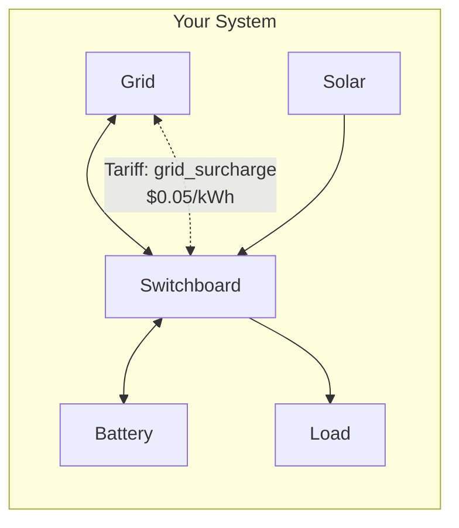

# Adding a Tariff to Your System

This walkthrough demonstrates adding a tariff to price tagged power flows between nodes in your energy system.

## System Overview

After completing this walkthrough, your system will include a tariff that adds per-kWh costs to specific power flows. This is useful for modeling:

- **Network usage charges**: Fees for power crossing between system segments
- **Source-specific pricing**: Different costs depending on where power originates
- **Demand charges**: Additional costs for power flowing through specific paths

## Prerequisites

You need an existing HAEO system with at least two configured nodes (e.g., from the [Sigenergy System](sigenergy-system.md) walkthrough).

## Step 1: Navigate to HAEO

Navigate to **Settings → Devices & services → HAEO** to access the integration page.

## Step 2: Add Tariff Element

Click **Add** and select **Tariff** from the element type list.

### Configure Endpoints

1. **Name**: Enter a descriptive name (e.g., "Grid Surcharge")
2. **Source Node**: Select the node where power originates (e.g., "Grid")
3. **Target Node**: Select the destination node (e.g., "Switchboard")

### Configure Tag Pricing

1. **Tag**: Enter a tag name to identify this pricing category (e.g., "grid_surcharge")
2. **Price Source→Target**: Enter the per-kWh cost for power flowing from source to target (e.g., 0.05)
3. **Price Target→Source**: Optionally enter a per-kWh cost for the reverse direction

Click **Submit** to create the tariff.

## Step 3: Verify

After creating the tariff, you should see new sensors:

- `sensor.grid_surcharge_tariff_power_source_target` — Power flowing through the tariff (source→target)
- `sensor.grid_surcharge_tariff_power_target_source` — Power flowing through the tariff (target→source)

The optimizer will now consider the tariff cost when routing power, potentially shifting some power flow to avoid the surcharge (e.g., using stored battery power instead of importing from the grid).

## Multiple Tariffs

You can add multiple tariffs to model complex pricing structures:

1. **Grid import surcharge**: Grid → Switchboard, $0.05/kWh
2. **Battery wear cost**: Battery → Switchboard, $0.01/kWh
3. **Solar export bonus**: Switchboard → Grid (negative pricing via export revenue adjustment)

Each tariff operates independently, and HAEO's optimizer considers all of them simultaneously to find the lowest-cost power flow plan.

## Next Steps

- Learn more about [tariff configuration](../user-guide/elements/tariff.md)
- Understand the [mathematical modeling](../modeling/device-layer/tariff.md)
- Explore [tag pricing segments](../modeling/model-layer/segments/tag-pricing.md) and [tag filter segments](../modeling/model-layer/segments/tag-filter.md)
