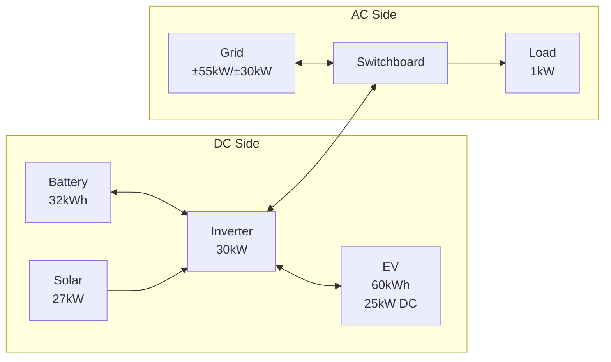

# Adding an EV to Your System

This walkthrough demonstrates adding an Electric Vehicle (EV) to an existing home energy system.
It covers setting up a trip calendar using the Local Calendar integration, creating recurring trip events, and configuring the EV element in HAEO.

## System Overview

After completing this walkthrough, your system will include:

- **Base system**: Inverter, battery, solar, grid, and load (from the [Sigenergy System](sigenergy-system.md) guide)
- **EV**: 60 kWh battery, 25 kW DC charge via Sigenergy charger, weekday commute schedule



## Prerequisites

Complete the [Sigenergy System](sigenergy-system.md) walkthrough first.
This guide builds on that configuration and adds an EV element.

```guide-setup
run_guide("sigenergy-system")
```

### EV-Specific Requirements

In addition to the base system, you will need:

- **EV connected sensor**: A binary sensor indicating whether the EV is plugged in
- **Odometer sensor**: A sensor reporting the EV's current odometer reading
- **Odometer at disconnect sensor**: A sensor capturing the odometer when the EV was last disconnected
- **EV battery SOC sensor**: A sensor reporting the EV's current state of charge

!!! tip "Where Do These Sensors Come From?"

    These sensors typically come from your EV manufacturer's integration (e.g., Tesla, Hyundai, Kia)
    or from your charger's integration (e.g., Wallbox, Easee, OpenEVSE).

## Step 1: Add Local Calendar Integration

HAEO uses a calendar to know when your EV will be away from home.
First, add the **Local Calendar** integration to create a dedicated trip calendar.

Navigate to **Settings → Devices & services** and add a new integration.

```guide
add_local_calendar(page, calendar_name="EV Trips")
```

The Local Calendar integration creates a calendar entity (`calendar.ev_trips`) that lives entirely within Home Assistant — no external service needed.

## Step 2: Create Trip Events

Navigate to the **Calendar** page and add a recurring event for your commute.
Include the round-trip distance in the event title so HAEO can calculate energy requirements.

```guide
create_calendar_event(
    page,
    title="Work commute 50km",
    start_time="08:00",
    end_time="17:30",
    recurrence="Weekly",
)
```

!!! tip "How HAEO Reads Trip Events"

    HAEO parses distances from event titles automatically — include a number followed by "km" or "mi".
    For example, "Work commute 50km" tells HAEO the round trip uses 50 km worth of energy.

    Each event represents a period when the car will be **away from home** and cannot charge from your system.

## Step 3: Navigate Back to HAEO

Return to the HAEO integration page to add the EV element.

```guide
page.navigate_to_settings()
page.navigate_to_integrations()
page.navigate_to_integration("HAEO")
```

## Step 4: Add EV Element

Configure the EV with battery details, charging rate, and trip calendar.
The EV connects to the **Inverter** since the Sigenergy 25 kW charger operates on the DC side.

```guide
add_ev(
    page,
    name="Commuter EV",
    connection="Inverter",
    calendar_entity=EntityInput("ev trips", "EV Trips"),
    connected=EntityInput("charger connected", "EV Charger Connected"),
    odometer=EntityInput("odometer", "EV Odometer"),
    odometer_at_disconnect=EntityInput("odometer at disconnect", "EV Odometer at Disconnect"),
    capacity=ConstantInput(60),
    energy_per_distance=ConstantInput(0.15),
    current_soc=EntityInput("battery state of charge", "EV Battery State of Charge"),
    max_charge_rate=ConstantInput(25),
)
```

!!! tip "Choosing the Right Sensors"

    - **Trip calendar**: The calendar entity you just created (`calendar.ev_trips`)
    - **Connected sensor**: A binary sensor that is "on" when the EV is plugged into the home charger
    - **Odometer**: The car's current total distance traveled
    - **Odometer at disconnect**: Captured when the car was last unplugged (used to calculate distance driven since disconnect)
    - **Battery SOC**: The EV's current battery percentage (0–100%)

!!! tip "Energy per Distance"

    Set this to your EV's average energy consumption in kWh/km.
    For example, 0.15 kWh/km means 15 kWh per 100 km.
    Check your EV's trip computer for a realistic average.

## Step 5: Verify Setup

After completing configuration, verify that all elements were created successfully.

```guide
verify_setup(page)
```

## Verification

Navigate to **Settings → Devices & Services → HAEO** to view the complete system.

### Expected Device Hierarchy

| Element     | Type | Key Sensors                                            |
| ----------- | ---- | ------------------------------------------------------ |
| Commuter EV | EV   | Charge power, energy stored, SOC, trip energy required |

The EV element adds to the existing base system elements (Inverter, Battery, Solar, Grid, Load).

### Key EV Sensors

- `sensor.commuter_ev_power_charge` — Optimal charging power (kW)
- `sensor.commuter_ev_power_discharge` — V2G discharge power (kW), if configured
- `sensor.commuter_ev_energy_stored` — Current energy in EV battery (kWh)
- `sensor.commuter_ev_state_of_charge` — EV battery percentage (%)
- `sensor.commuter_ev_trip_energy_required` — Energy needed for upcoming trips (kWh)
- `sensor.commuter_ev_public_charge_power` — Public charging power while away (kW)

All sensors include a `forecast` attribute with optimized future values.

### What to Expect

With a weekday commute configured:

- **Overnight**: HAEO charges the EV during cheapest electricity periods
- **Before departure**: The EV reaches sufficient charge for the trip distance
- **During work hours**: The EV is marked as away; public charging may apply if needed
- **After return**: HAEO resumes home charging based on remaining schedule

The optimizer balances EV charging against battery storage, solar generation, and grid prices to minimize total system cost.

## Next Steps

<div class="grid cards" markdown>

- :material-car-electric:{ .lg .middle } **EV element reference**

    ---

    Detailed configuration options for EV elements.

    [:material-arrow-right: EV configuration](../user-guide/elements/ev.md)

- :material-math-integral:{ .lg .middle } **EV modeling**

    ---

    Mathematical details of how EVs are modeled.

    [:material-arrow-right: EV modeling](../modeling/device-layer/ev.md)

- :material-home-lightning-bolt:{ .lg .middle } **Automation examples**

    ---

    Use optimization results to control your EV charger.

    [:material-arrow-right: Automations](../user-guide/automations.md)

</div>
