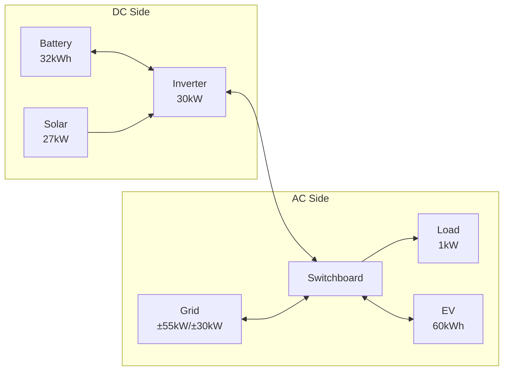

# Adding an EV to Your System

This walkthrough demonstrates adding an Electric Vehicle (EV) to an existing home energy system.
The guide starts by configuring a base system with solar, battery, grid, and load, then walks through adding an EV with calendar-based trip scheduling.

## System Overview

The complete system after this walkthrough:

- **Battery**: 32 kWh (Sigenergy SigenStor), 99% efficiency
- **Solar**: 27 kW peak (four orientations: East, North, South, West)
- **Inverter**: 30 kW hybrid inverter (DC/AC coupling)
- **Grid**: 55 kW import limit, 30 kW export limit
- **Load**: 1 kW constant base load
- **EV**: 60 kWh battery, 7.4 kW max charge, weekday commute schedule



## Prerequisites

Before starting this walkthrough, ensure you have:

### Required Integrations

- **HAEO**: Installed via HACS (see [Installation guide](../user-guide/installation.md))
- **Sigenergy**: Provides battery capacity and SOC sensors
- **Solar Forecast**: [Open-Meteo Solar Forecast](https://www.home-assistant.io/integrations/open_meteo_solar_forecast/) integration
- **Electricity Pricing**: Any integration providing import/export price forecasts

### EV-Specific Requirements

- **Calendar integration**: A Home Assistant calendar entity with trip events (e.g., Google Calendar, Local Calendar)
- **EV connected sensor**: A binary sensor indicating whether the EV is plugged in
- **Odometer sensor**: A sensor reporting the EV's current odometer reading
- **Odometer at disconnect sensor**: A sensor capturing the odometer when the EV was last disconnected
- **EV battery SOC sensor**: A sensor reporting the EV's current state of charge

!!! tip "Setting Up a Trip Calendar"

    Create a dedicated calendar for EV trips. Each event represents a period when the car will be away from home.
    Include the round-trip distance in the event title (e.g., "Work commute 50km").

    HAEO parses distances from event summaries automatically — just include a number followed by "km" or "mi".

## Part 1: Base System Configuration

First, set up the base energy system with battery, solar, grid, and load.
If you already have a system configured, skip ahead to [Part 2: Adding the EV](#part-2-adding-the-ev).

### Step 1: Log In and Add HAEO

Log in to your Home Assistant instance, navigate to **Settings → Devices & services**, and add the HAEO integration.

```guide
login(page)

add_integration(
    page,
    network_name="Home Energy",
)
```

### Step 2: Add Inverter

The Inverter element models your hybrid inverter with its built-in DC bus.

```guide
add_inverter(
    page,
    name="Inverter",
    connection="Switchboard",
    max_power_source_target=EntityInput("max active power", "Sigen Plant Max Active Power"),
    max_power_target_source=EntityInput("max active power", "Sigen Plant Max Active Power"),
)
```

### Step 3: Add Battery

Configure the battery, connecting to the Inverter's DC side.

```guide
add_battery(
    page,
    name="Battery",
    connection="Inverter",
    capacity=EntityInput("rated energy", "Rated Energy Capacity"),
    initial_charge_percentage=EntityInput("state of charge", "Battery State of Charge"),
    max_power_target_source=EntityInput("rated charging", "Rated Charging Power"),
    max_power_source_target=EntityInput("rated discharging", "Rated Discharging Power"),
    min_charge_percentage=ConstantInput(10),
    max_charge_percentage=ConstantInput(100),
)
```

### Step 4: Add Solar

Configure solar with forecast sensors for each orientation.

```guide
add_solar(
    page,
    name="Solar",
    connection="Inverter",
    forecast=[
        EntityInput("east solar today", "East solar production forecast"),
        EntityInput("north solar today", "North solar production forecast"),
        EntityInput("south solar today", "South solar prediction forecast"),
        EntityInput("west solar today", "West solar production forecast"),
    ],
)
```

### Step 5: Add Grid Connection

Configure grid pricing and limits, connecting to the Switchboard.

```guide
add_grid(
    page,
    name="Grid",
    connection="Switchboard",
    price_source_target=[
        EntityInput("general price", "Home - General Price"),
        EntityInput("general forecast", "Home - General Forecast"),
    ],
    price_target_source=[
        EntityInput("feed in price", "Home - Feed In Price"),
        EntityInput("feed in forecast", "Home - Feed In Forecast"),
    ],
    max_power_source_target=ConstantInput(55),
    max_power_target_source=ConstantInput(30),
)
```

### Step 6: Add Load

Configure a constant base load, connecting to the Switchboard.

```guide
add_load(
    page,
    name="Constant Load",
    connection="Switchboard",
    forecast=ConstantInput(1),
)
```

## Part 2: Adding the EV

Now add the EV element to the existing system.
The EV connects to the Switchboard (AC side) where the charger is.

### Understanding EV Trip Scheduling

HAEO uses a calendar to know when your EV will be away from home.
When the car is away, it cannot charge from your home system — but it can "public charge" at a configurable cost.
HAEO also calculates the energy needed for each trip based on the distance in the calendar event.

For a weekday commute:

1. Create a recurring calendar event (e.g., every weekday 8:00 AM to 5:30 PM)
2. Include the round-trip distance in the event title: **"Work commute 50km"**
3. HAEO will ensure the battery has enough energy before each departure

### Step 7: Add EV

Configure the EV with battery details, charging rate, and trip calendar.
The EV connects to the **Switchboard** since the charger is on the AC side.

```guide
add_ev(
    page,
    name="Commuter EV",
    connection="Switchboard",
    calendar_entity=EntityInput("trip calendar", "EV Trip Calendar"),
    connected=EntityInput("charger connected", "EV Charger Connected"),
    odometer=EntityInput("odometer", "EV Odometer"),
    odometer_at_disconnect=EntityInput("odometer at disconnect", "EV Odometer at Disconnect"),
    capacity=ConstantInput(60),
    energy_per_distance=ConstantInput(0.15),
    current_soc=EntityInput("battery state of charge", "EV Battery State of Charge"),
    max_charge_rate=ConstantInput(7.4),
)
```

!!! tip "Choosing the Right Sensors"

    - **Trip calendar**: A calendar entity with events for when the car is away
    - **Connected sensor**: A binary sensor that is "on" when the EV is plugged into the home charger
    - **Odometer**: The car's current total distance traveled
    - **Odometer at disconnect**: Captured when the car was last unplugged (used to calculate distance driven since disconnect)
    - **Battery SOC**: The EV's current battery percentage (0–100%)

!!! tip "Energy per Distance"

    Set this to your EV's average energy consumption in kWh/km.
    For example, 0.15 kWh/km means 15 kWh per 100 km.
    Check your EV's trip computer for a realistic average.

### Step 8: Verify Setup

After completing configuration, verify that all elements were created successfully.

```guide
verify_setup(page)
```

## Verification

Navigate to **Settings → Devices & Services → HAEO** and click on "Home Energy" to view the device page.

### Expected Device Hierarchy

| Element       | Type     | Key Sensors                                               |
| ------------- | -------- | --------------------------------------------------------- |
| Home Energy   | Network  | Optimization cost, status, duration                       |
| Switchboard   | Node     | Power balance shadow price                                |
| Inverter      | Inverter | DC to AC power, AC to DC power                            |
| Battery       | Battery  | Charge/discharge power, energy stored, SOC                |
| Solar         | Solar    | Power, forecast limit                                     |
| Grid          | Grid     | Import/export power, import cost, export revenue          |
| Constant Load | Load     | Power                                                     |
| Commuter EV   | EV       | Charge power, energy stored, SOC, trip energy required    |

### Key EV Sensors

- `sensor.commuter_ev_power_charge` — Optimal charging power (kW)
- `sensor.commuter_ev_power_discharge` — V2G discharge power (kW), if configured
- `sensor.commuter_ev_energy_stored` — Current energy in EV battery (kWh)
- `sensor.commuter_ev_state_of_charge` — EV battery percentage (%)
- `sensor.commuter_ev_trip_energy_required` — Energy needed for upcoming trips (kWh)
- `sensor.commuter_ev_public_charge_power` — Public charging power while away (kW)

All sensors include a `forecast` attribute with optimized future values.

### What to Expect

With a weekday commute configured:

- **Overnight**: HAEO charges the EV during cheapest electricity periods
- **Before departure**: The EV reaches sufficient charge for the trip distance
- **During work hours**: The EV is marked as away; public charging may apply if needed
- **After return**: HAEO resumes home charging based on remaining schedule

The optimizer balances EV charging against battery storage, solar generation, and grid prices to minimize total system cost.

## Next Steps

<div class="grid cards" markdown>

- :material-car-electric:{ .lg .middle } **EV element reference**

    ---

    Detailed configuration options for EV elements.

    [:material-arrow-right: EV configuration](../user-guide/elements/ev.md)

- :material-math-integral:{ .lg .middle } **EV modeling**

    ---

    Mathematical details of how EVs are modeled.

    [:material-arrow-right: EV modeling](../modeling/device-layer/ev.md)

- :material-home-lightning-bolt:{ .lg .middle } **Automation examples**

    ---

    Use optimization results to control your EV charger.

    [:material-arrow-right: Automations](../user-guide/automations.md)

</div>
